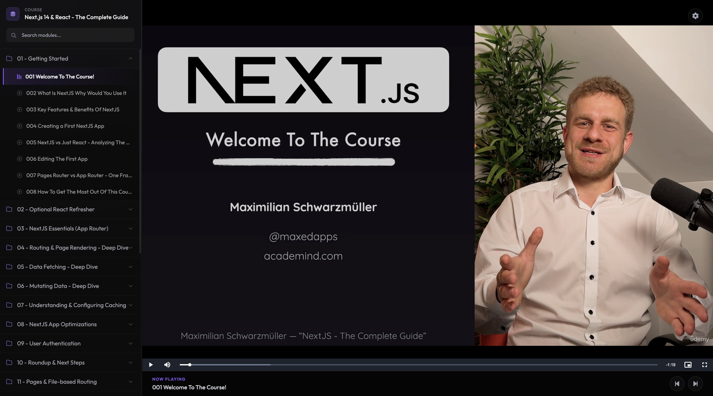

<h1 align="center">
  
    Drive | Stream Drive Video 🖖

</h1>
 

  <!-- Version -->
  
  <!-- Downloads -->
  
  <!-- Issues -->
  
  <!-- License -->
  

 

	
  Paste any Google Drive folder link, auto-organize modules, and stream high-definition course videos in real time with custom shortcuts, zero buffering, and study-time tracking.   
  ## Preview
  
  Project originally by [@Thnoxs](https://github.com/Thnoxs/python-dawnloader) is archived. 

